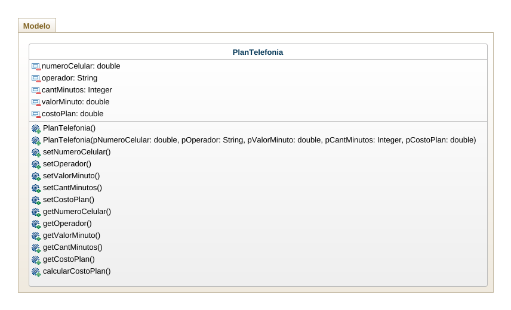
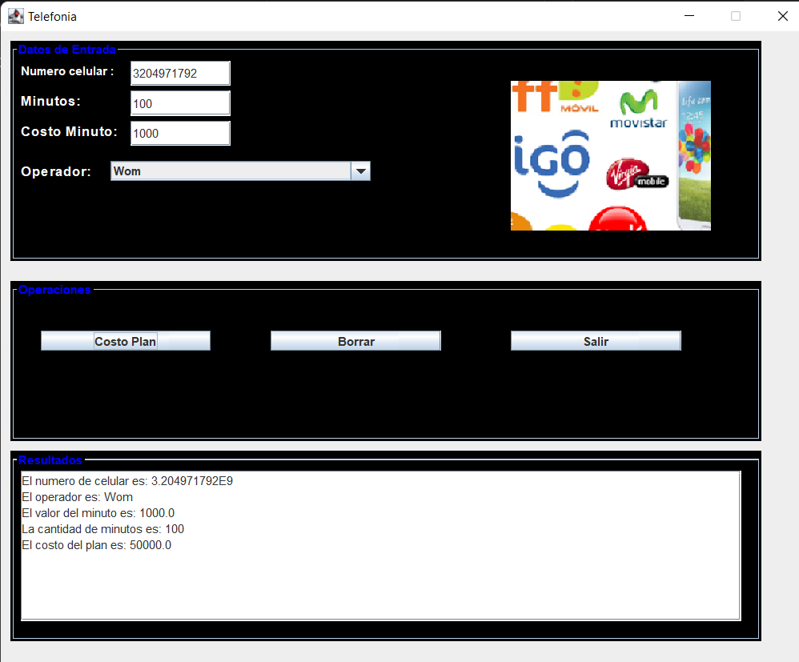

# telefonia
realice el analisis (Identificar clases , atributos, metodos), diseño (Diagrama de clases) y construccion (patron MVC)

se desea gestionar un plan de telefonia movil el plan tiene un numero de celular , un operador , una cantidad sde minutos y un costo por minuto

calcular el total a pagar teniendo en cuenta que si el operador es "wom" tiene un 50% de descuento 
usar minimo 2 metodos constructores.

# Diagrama de clases 

# Prueba 1 

